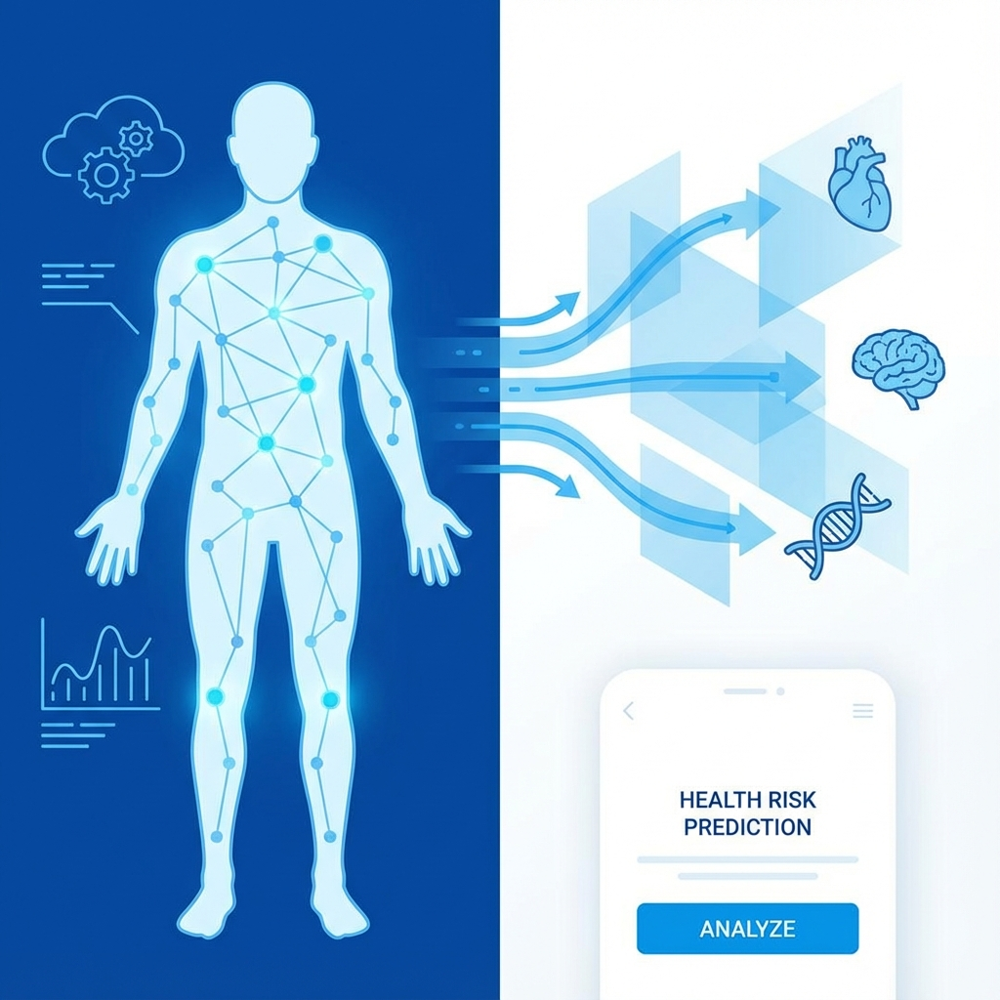

# Health Risk Predictor



A machine learning-powered application that assesses potential health risks based on individual biometric data. This tool utilizes a predictive model to categorize health risks associated with BMI, age, and lifestyle factors.

## 🏥 Project Overview

The **Health Risk Predictor** is designed to provide quick, preliminary health assessments. By analyzing key inputs such as Age, Gender, Smoking Status, and BMI, the application predicts potential health risks, helping users become more aware of their health status.

### Key Features
- **Instant BMI Calculation**: Automatically calculates Body Mass Index from height and weight.
- **Risk Categorization**: Classifies health risks into Low (Diabetic), Moderate (Pneumonia), and High (Cancer) based on the trained model.
- **User-Friendly Interface**: Built with Streamlit for a clean and interactive experience.

## 🛠️ Tech Stack
- **Python**: Core logic and data processing.
- **Streamlit**: Web application framework.
- **Scikit-Learn**: Machine learning model implementation.
- **NumPy**: Numerical operations.

## 🚀 Installation & Usage

1. **Clone the repository**
   ```bash
   git clone https://github.com/pranavsinghpatil/Health-Risk-Prediction-by-BMI.git
   cd Health-Risk-Prediction-by-BMI
   ```

2. **Install dependencies**
   ```bash
   pip install -r requirements.txt
   ```

3. **Run the application**
   ```bash
   streamlit run front.py
   ```

## 📊 Model Details
The application uses a pre-trained machine learning model (`health_risk_model.pkl`) to infer health risks. The model takes into account:
- Age
- Gender
- Smoking Status
- BMI (Calculated)

## ⚠️ Disclaimer
This tool is for educational and informational purposes only. It is not a substitute for professional medical advice, diagnosis, or treatment.